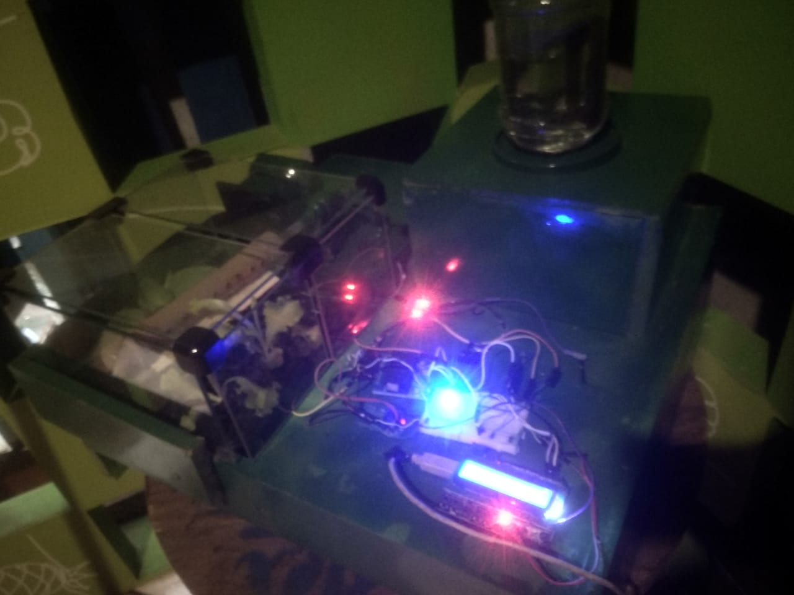

#Horta automatizada com Arduino
Este projeto visa criar uma horta automatizada controlada por Arduino. A horta é composta por vasos com plantas que são irrigadas automaticamente e monitoradas através de sensores.

#Materiais
-Arduino Uno
-Shild dilplay
-3 Módulo de relé
-Sensor de umidade do solo
-Bomba de água
-Valvula selanoide
-Culer
-Estrutura de madeira
-Plantas

#Funcionamento
O sistema é controlado por um programa no Arduino que monitora a umidade do solo e ativa a bomba de água através do módulo de relé quando a umidade estiver abaixo do limite estabelecido. O tubo de PVC distribui a água pelos vasos de forma eficiente e uniforme.

#Diagrama de funcionamento

#Montagem
A montagem é simples e pode ser feita em casa com poucas ferramentas. O sensor de umidade do solo é conectado ao Arduino e posicionado no solo do vaso. A bomba de água é conectada ao módulo de relé que é controlado pelo Arduino.

#Montagem do sistema

#Resultado
Com a horta automatizada, é possível ter plantas saudáveis e bem irrigadas sem precisar se preocupar em regá-las diariamente. Além disso, o sistema permite um melhor aproveitamento da água e evita o desperdício.

#Horta automatizada em ação

Conclusão
Este projeto é uma ótima opção para quem deseja cultivar plantas de forma eficiente e automatizada. Com alguns materiais simples e um pouco de conhecimento em eletrônica, é possível criar uma horta automatizada controlada por Arduino.
