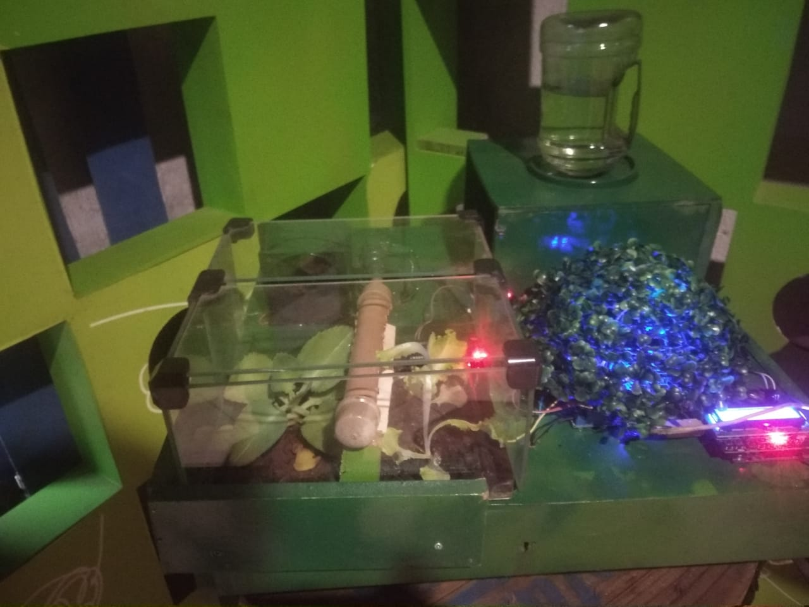
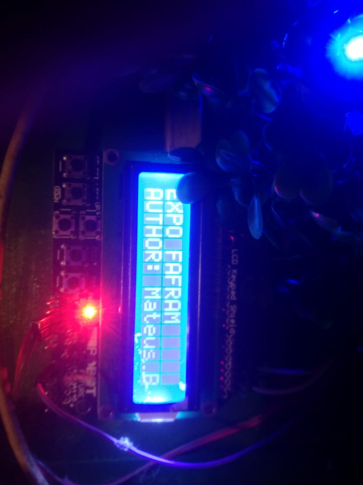
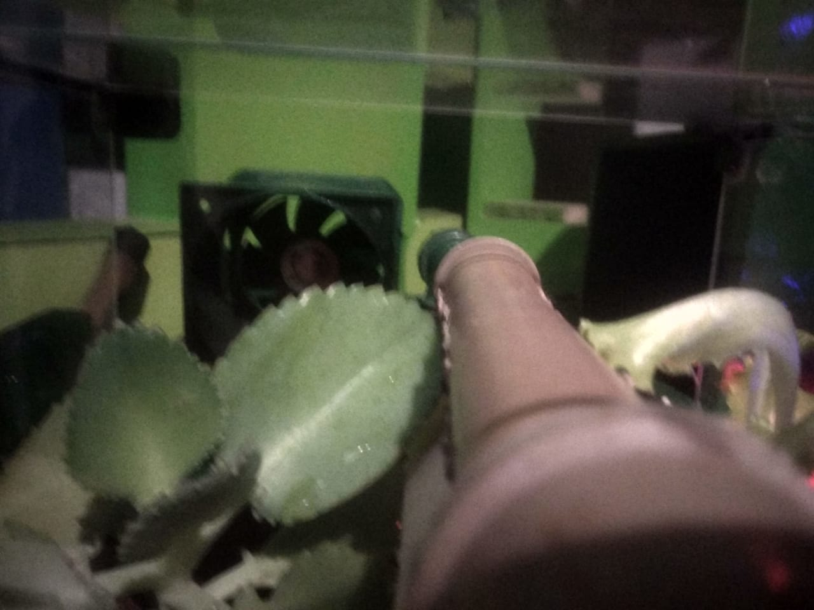

<h1>Horta automatizada com Arduino</h1>
Este projeto visa criar uma horta automatizada controlada por Arduino. A horta é composta por vasos com plantas que são irrigadas automaticamente e monitoradas através de sensores.

<h2>Materiais</h2>
<ul>
<li>-Arduino Uno</li>
<li>-Shild dilplay</li>
<li>-3 Módulo de relé</li>
<li>-Sensor de umidade do solo</li>
<li>-Bomba de água</li>
<li>-Valvula selanoide</li>
<li>-Culer</li>
<li>-Estrutura de madeira</li>
<li>-Plantas</li>
</ul>

<h2>Funcionamento</h2>
O sistema é controlado por um programa no Arduino que monitora a umidade do solo e ativa a bomba de água através do módulo de relé quando a umidade estiver abaixo do limite estabelecido. O tubo de PVC distribui a água pelos vasos de forma eficiente e uniforme.

<h2>Montagem</h2>
A montagem é simples e pode ser feita em casa com poucas ferramentas. O sensor de umidade do solo é conectado ao Arduino e posicionado no solo do vaso. A bomba de água é conectada ao módulo de relé que é controlado pelo Arduino.

<h2>Horta automatizada em ação</h2>

<h2>Resultado</h2>
Com a horta automatizada, é possível ter plantas saudáveis e bem irrigadas sem precisar se preocupar em regá-las diariamente. Além disso, o sistema permite um melhor aproveitamento da água e evita o desperdício.

<h2>Conclusão</h2>
Este projeto é uma ótima opção para quem deseja cultivar plantas de forma eficiente e automatizada. Com alguns materiais simples e um pouco de conhecimento em eletrônica, é possível criar uma horta automatizada controlada por Arduino.
